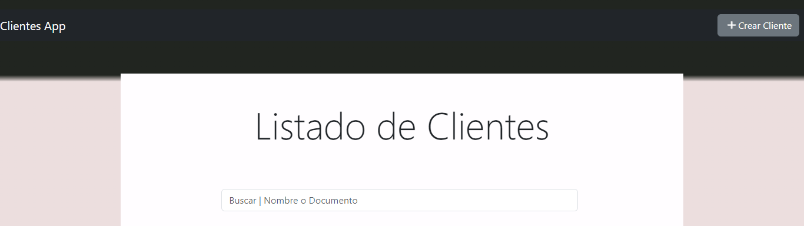

# CLIENTES_API_REACT



# Clientes App
## Descripción 
Se creo un aplicacion donde permite un CRUD basico de una lista de clientes
en la cual se puede buscar por nombre y/o numero de documento

### Rutas

1. /clientes Lista de clientes
2. /cliente/{id} Visulizacion y edicion de un cliente en especifico
3. /cliente/add Creacion de clientes

los datos se cargan desde uan API creada en Django Rest Framework

[API](https://api-clientes-django.onrender.com/clientes/api/v1/cliente/) 

 

## Clonar repositorio  
```
git clone https://github.com/davis45368/CLIENTES_FRONTEND_REACT.git 
```

 

## tecnologías
***
* [React](https://es.react.dev/): Version 18.2.0
* [Vite](https://vitejs.dev/): Version 4.4.9

